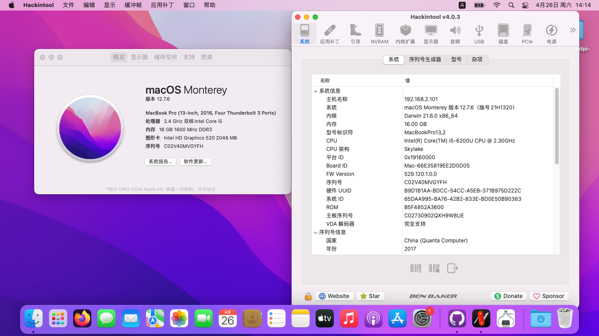

# DELL-Vostro-3459-i5-6200U-Hackintosh
应用于戴尔Vostro 成就 14 3459的OpenCore 1.0.4的黑苹果引导 支持macOS Monterey 12.7.6 

注意：
- 此EFI不含三码 实际使用时请自行使用[OCAT](https://github.com/ic005k/OCAuxiliaryTools)生成


### 配置清单
|类型|型号|规格|
|---|---|---|
|CPU|Intel Core i5-6200U|2.30 GHz|
|内存|Samsung M471B1G73BH0-YK0 8GB×2|1600 MHz|
|SSD|ONDA A-24 256 GB|SATA|
|光驱|HL-DT-ST DVD+/-RW GU90N|SATA|
|iGPU|Intel HD Graphics 520|2048 MB|
|dGPU|AMD Radeon R5 M315|2048 MB|
|网卡|RealTek RTL8168|1000 Mbps|
|Wi-Fi|Intel Wi-Fi AC-3160|m.2|
|声卡|RealTek ALC255|立体声|
|操作系统|macOS Monterey|12.0-12.7.6|
|BIOS|American Megatrends UEFI|1.8.0|

#### 无法工作的部分
- 隔空投送和接力：需要加装博通WI-FI网卡，部分型号需要搭配[AirportBrcmFixup](https://github.com/acidanthera/AirportBrcmFixup)驱动使用。
- 独立显卡：无解
- DRM硬解：无解

#### 附注事项
- 需要关闭CFG Lock，你可以在[这里](https://www.dell.com/support/product-details/zh-cn/product/vostro-14-3459-laptop/drivers)下载并更新最新版的BIOS，并在Grub Shell里输入以下指令：
```
setup_var 0x108 0x00
```
- 睡眠唤醒未解决，如果出现睡死问题，可尝试在终端里输入以下命令以关闭睡眠功能：
```
sudo pmset -a sleep 0
sudo pmset -a hibernatemode 0
sudo pmset -a disablesleep 1
```
- 此EFI仅在**Monterey**中测试通过，其它版本的macOS未做测试。
